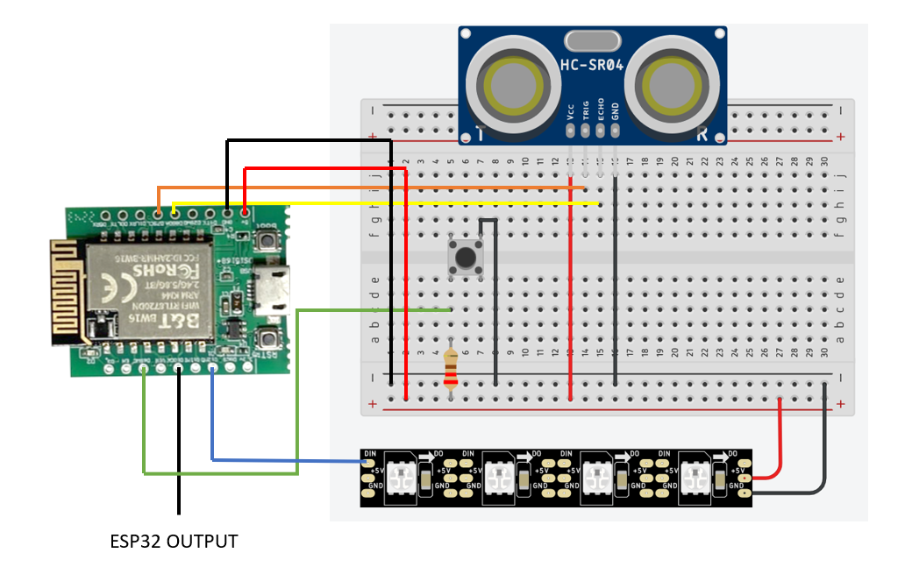

# 物聯網小專題
## HUB5168+端

## 物理腳位

接腳定義
``` c
#define EspPIN 10                 // 接收esp32訊號腳位
#define BtnPIN 6                  // 按鈕腳位，用來控制燈條顯示模式
#define TRIG_PIN 7                // 超音波TRIG
#define ECHO_PIN 8                // 超音波ECHO

#define LED_PIN 12                // LED燈條腳位
```
## 程式碼說明
位置在 `code/demo/demo.ino`
此程式在接入esp32的控制後，可以讓燈條顯示各樣的功能，按下BUTTON可以切換以下功能
1. 冷光距離感應燈
2. 暖光距離感應燈
3. 冷光引導燈
4. 暖光常亮燈
5. 冷光常亮燈
6. 物理關閉燈條
